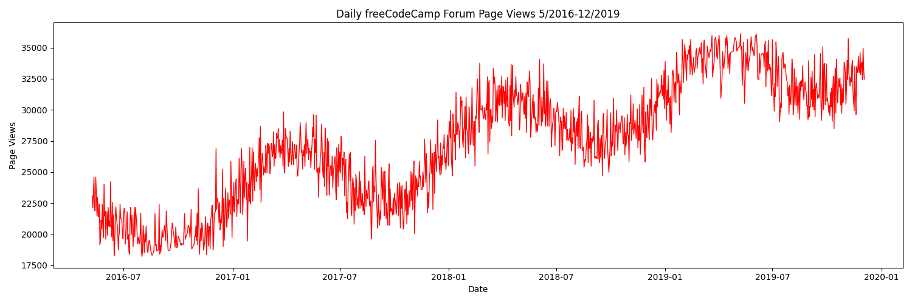
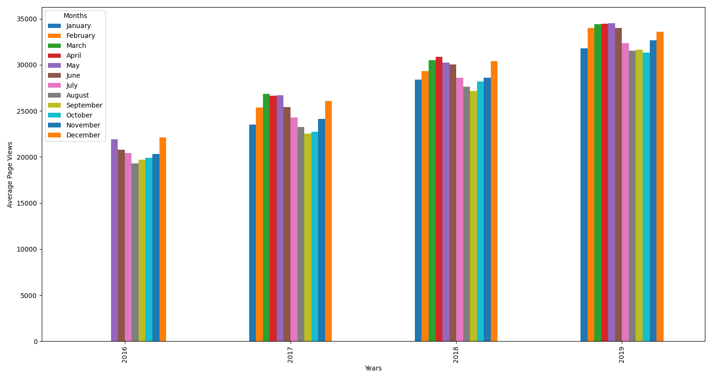
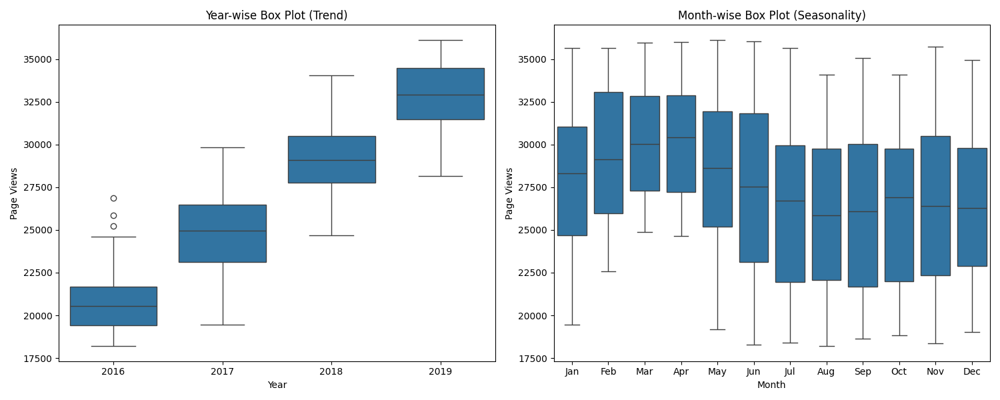

# 📈 Page View Time Series Visualizer

This project explores website traffic trends using time series visualization techniques. It analyzes daily page views from the [freeCodeCamp.org](https://forum.freecodecamp.org) forum between **May 2016 and December 2019**. The main goal is to understand patterns in user engagement and seasonality through line charts, bar plots, and box plots.

---

## 🧠 Summary

As part of the **freeCodeCamp Data Analysis with Python** certification, this project demonstrates the use of `Pandas`, `Matplotlib`, and `Seaborn` to perform time series analysis. Insights gained help reveal yearly growth and seasonal engagement patterns on the forum.

---

## 📁 Dataset

- **File:** `fcc-forum-pageviews.csv`
- **Source:** Synthesized based on real-world usage patterns
- **Duration:** `2016-05-09` to `2019-12-03`
- **Frequency:** Daily observations
- **Feature:**  
  - `date`: Daily timestamps  
  - `value`: Number of page views

The data was cleaned by removing outliers outside the 2.5th and 97.5th percentiles to improve visualization clarity.

---

## 🔍 Visualizations

### 🔹 Line Plot: Daily Page Views Over Time

A continuous line chart showing trends in daily page views across the entire dataset range.

---

### 🔸 Bar Plot: Monthly Averages by Year

A bar chart representing average monthly page views grouped by year.

---

### 🟪 Box Plots: Year-wise and Month-wise Distribution

Two box plots visualizing distribution:
- 📅 **Year-wise** trend: median, IQR, and outliers across years
- 🗓 **Month-wise** seasonality: variation across months over all years

---

## 📌 Insights & Recommendation

- Page views increased steadily from 2016 to 2019, reflecting growing user engagement.
- Traffic spikes are seasonal — particularly early and late in the year.
- Platform activity aligns with academic cycles and self-improvement periods.

**Recommendation:**  
freeCodeCamp should align marketing, events, or curriculum launches with traffic peaks (e.g. January, October–December) for greater visibility and impact.

---

## 🧪 Skills Demonstrated

- Time Series Cleaning & Outlier Removal  
- Feature Engineering (datetime handling)  
- Grouping & Aggregation by Month/Year  
- Advanced Visualization with Seaborn & Matplotlib  
- Real-world Data Storytelling  

---

## ⚙️ Tech Stack

- 🐍 Python 3
- 📊 Pandas
- 📉 Matplotlib
- 🧮 NumPy
- 🎨 Seaborn
- 🧠 Google Colab / Jupyter Notebook

---

## 📬 Contact

- 📧 Email: oluwatoyin.eniitan2020@gmail.com  
- 🔗 LinkedIn: [https://www.linkedin.com/in/eniitan-oluwatoyin-93ab9022b/](https://www.linkedin.com/in/eniitan-oluwatoyin-93ab9022b/)  
- 🧠 GitHub: [https://github.com/GRACEDOFGOD](https://github.com/GRACEDOFGOD)

---

## ✅ Certification

This project was built as part of the **freeCodeCamp Data Analysis with Python Certification**.

> Feel free to fork, adapt, or expand this project for your own data science portfolio!
> Thank you and God Bless you
> Jesus Loves you
